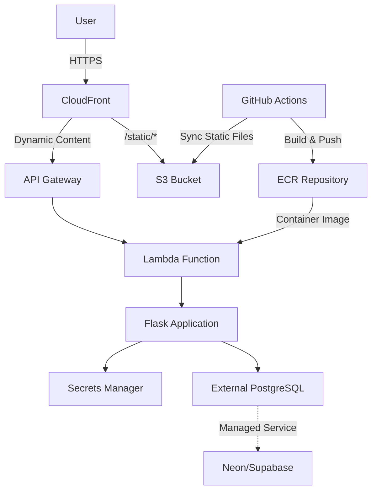

# System Architecture

This document outlines the high-level architecture of the Meal Expense Tracker application. For detailed technology
choices and implementation details, see [TECHNOLOGY.md](TECHNOLOGY.md).

## 🏗 High-Level Architecture

## 🧩 Core Components

### 1. Backend

- **Flask Application**
- WSGI-based web framework
- RESTful API endpoints
- Request/response handling

- **AWS Lambda Integration**

  - Serverless execution environment
  - WSGI adapter for Flask
  - Environment-based configuration
  - Container image deployment via ECR

- **API Gateway**

  - HTTP API configuration
  - Request routing
  - Authentication/Authorization

- **CloudFront CDN**

  - Smart routing: static files from S3, dynamic content to API Gateway
  - Edge caching for static assets
  - HTTPS termination
  - Custom domain support

- **S3 Storage**
  - Static file hosting (CSS, JS, images)
  - Secure access via Origin Access Control (OAC)
  - Receipt storage with encryption

### 2. Database

- External managed PostgreSQL (Neon/Supabase) for production
- SQLite for local development
- Managed backups and point-in-time recovery (handled by external provider)
- **Zero infrastructure cost** (free tier)

### 3. Static File Delivery

- **S3 Bucket**: Hosts static assets (CSS, JS, images)
- **CloudFront Distribution**: CDN for fast global delivery
- **Origin Access Control**: Secure S3 access via CloudFront only
- **Smart Routing**: `/static/*` paths routed to S3, all else to API Gateway

### 4. Authentication

- Session-based authentication
- Role-based access control

### 5. Infrastructure

- Infrastructure as Code with Terraform
- Multi-environment support (dev, staging, prod)
- Automated provisioning and deployment
- **Container Registry**: Amazon ECR for Lambda container images
- **Simplified networking** - no VPC required (Lambda connects via HTTPS)
- **Cost optimized** - $0 database infrastructure costs

## 🔄 Data Flow

1. **Request Routing**

- User requests arrive at CloudFront
- Static file requests (`/static/*`) routed to S3 bucket
- Dynamic requests routed to API Gateway → Lambda

1. **User Authentication**

- Secure session-based authentication
  - Role-based access control
  - Session management

1. **Expense Management**

- CRUD operations for expenses
  - Data validation and sanitization
  - Real-time updates via WebSockets (future)

1. **Reporting**

- Data aggregation
  - Report generation
  - Export functionality

## 🛡️ Security

- End-to-end encryption
- Input validation and sanitization
- Regular security audits
- Dependency vulnerability scanning

## 📈 Scalability

- Stateless architecture
- Horizontal scaling
- Caching layer (future)
- Database read replicas (future)

## 📚 Documentation

- [DEVELOPMENT.md](DEVELOPMENT.md): Development setup and workflow
- [TECHNOLOGY.md](TECHNOLOGY.md): Technology stack and implementation details
- [ADRs](architecture/decisions/): Architecture Decision Records
  - [0001: Infrastructure as Code](architecture/decisions/0001-infrastructure-as-code.md)
  - [0002: CI/CD Pipeline](architecture/decisions/0002-ci-cd-pipeline.md)
  - [0003: AWS Service Selection](architecture/decisions/0003-aws-service-selection.md)
  - [0004: KMS Encryption Strategy](architecture/decisions/0004-kms-encryption-strategy.md)
  - [0005: Container Orchestration](architecture/decisions/0005-container-orchestration.md)

## 🚀 Deployment

- **Lambda Deployment**: Docker container images built and pushed to ECR
- **Static Files**: Synced to S3 bucket and served via CloudFront
- Automated CI/CD pipeline
- Blue/green deployments
- Canary releases (future)
- Rollback capabilities

## 🔍 Monitoring & Observability

- Centralized logging
- Application metrics
- Performance monitoring
- Error tracking

## 🔄 Development Workflow

1. Create feature branch
2. Implement changes with tests
3. Submit pull request
4. Code review and CI checks
5. Merge to main
6. Automated deployment to staging
7. Manual promotion to production

## 📝 License

This project is licensed under the MIT License - see the [LICENSE](LICENSE) file for details.
