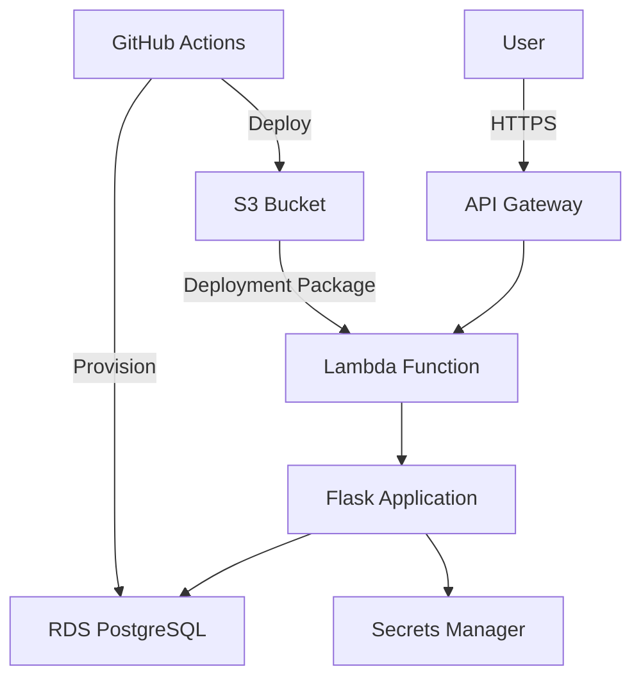

# System Architecture

This document outlines the high-level architecture of the Meal Expense Tracker application. For detailed technology choices and implementation details, see [TECHNOLOGY.md](TECHNOLOGY.md).

## 🏗 High-Level Architecture

## 🧩 Core Components

### 1. Backend

- **Flask Application**
  - WSGI-based web framework
  - RESTful API endpoints
  - Request/response handling

- **AWS Lambda Integration**
  - Serverless execution environment
  - WSGI adapter for Flask
  - Environment-based configuration
  - Deployment package in S3

- **API Gateway**
  - HTTP API configuration
  - Request routing
  - Authentication/Authorization

### 2. Database
- AWS RDS PostgreSQL for production
- SQLite for local development
- Managed backups and point-in-time recovery

### 3. Authentication
- JWT-based authentication
- Role-based access control

### 4. Infrastructure
- Infrastructure as Code with Terraform
- Multi-environment support (dev, staging, prod)
- Automated provisioning and deployment
- VPC networking with security groups and NACLs

## 🔄 Data Flow

1. **User Authentication**
   - Secure JWT-based authentication
   - Role-based access control
   - Session management

2. **Expense Management**
   - CRUD operations for expenses
   - Data validation and sanitization
   - Real-time updates via WebSockets (future)

3. **Reporting**
   - Data aggregation
   - Report generation
   - Export functionality

## 🛡️ Security

- End-to-end encryption
- Input validation and sanitization
- Regular security audits
- Dependency vulnerability scanning

## 📈 Scalability

- Stateless architecture
- Horizontal scaling
- Caching layer (future)
- Database read replicas (future)

## 📚 Documentation

- [DEVELOPMENT.md](DEVELOPMENT.md): Development setup and workflow
- [TECHNOLOGY.md](TECHNOLOGY.md): Technology stack and implementation details
- [ADRs](architecture/decisions/): Architecture Decision Records
  - [0001: Infrastructure as Code](architecture/decisions/0001-infrastructure-as-code.md)
  - [0002: CI/CD Pipeline](architecture/decisions/0002-ci-cd-pipeline.md)
  - [0003: AWS Service Selection](architecture/decisions/0003-aws-service-selection.md)
  - [0004: KMS Encryption Strategy](architecture/decisions/0004-kms-encryption-strategy.md)
  - [0005: Container Orchestration](architecture/decisions/0005-container-orchestration.md)

## 🚀 Deployment

- Automated CI/CD pipeline
- Blue/green deployments
- Canary releases (future)
- Rollback capabilities

## 🔍 Monitoring & Observability

- Centralized logging
- Application metrics
- Performance monitoring
- Error tracking

## 🔄 Development Workflow

1. Create feature branch
2. Implement changes with tests
3. Submit pull request
4. Code review and CI checks
5. Merge to main
6. Automated deployment to staging
7. Manual promotion to production

## 📝 License

This project is licensed under the MIT License - see the [LICENSE](LICENSE) file for details.
